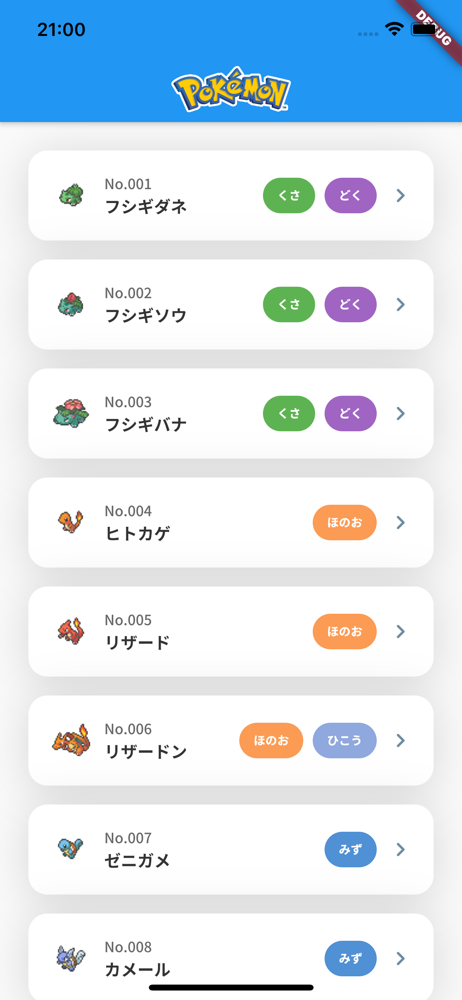

# flutter_provider_sample

A sample Flutter project for Provider.
Using [pokemon.json](https://github.com/fanzeyi/pokemon.json).



## Getting Started

### Flutter SDK

Install flutter sdk with [asdf](https://asdf-vm.com/).

```bash
asdf install
asdf reshim
```

### Gem

Install gems for iOS.

```bash
cd ios
cd bundle install
bundle exec pod install
```

### Generate files

Run `build_runner` and generate files defined with
[freezed](https://pub.dev/packages/freezed) and [mockito](https://pub.dev/packages/mockito).

```bash
make gen/build
```

or if you want to watch changes of definition files, then

```bash
make gen/watch
```

## Architecture

### Provider + StateNotifier + Freezed

-   Provider: Provides services and notifiers.
-   StateNotifier: Controllers for a Page.
-   Freezed: Generates entities and states with freezed.

### Repository Pattern

-   Entity
-   Repository
-   Service

### Atomic Disign Pattern

-   Atom
-   Molecule
-   Organism
-   Page
